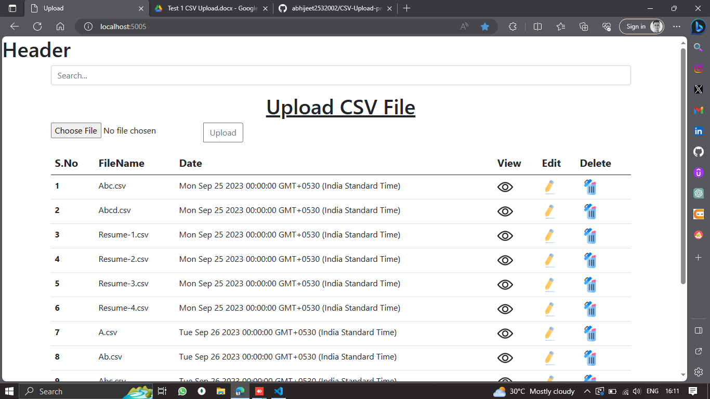
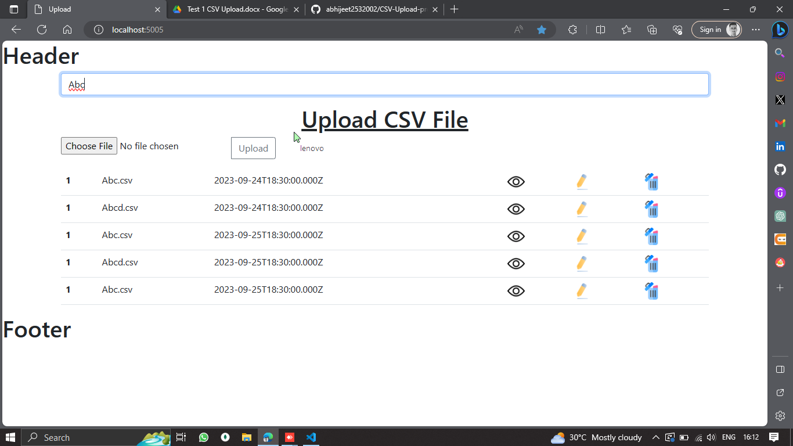
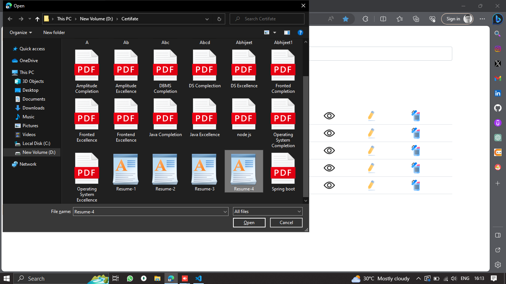

```markdown
# CSV Upload and Management System in Node.js

Welcome to the CSV Upload and Management System in Node.js! This web application simplifies the management of CSV data, allowing you to upload, delete, search, and view CSV files with ease.

## Table of Contents
1. [Getting Started](#getting-started)
   - [Prerequisites](#prerequisites)
   - [Installation](#installation)
2. [Usage](#usage)
3. [Features](#features)
4. [Contributing](#contributing)
5. [License](#license)
6. [Additional Sections](#additional-sections)

## Getting Started

### Prerequisites
Before you begin, ensure you have the following prerequisites:

- [Node.js](https://nodejs.org/) installed on your machine.
- [npm](https://www.npmjs.com/) (Node Package Manager) installed.

### Installation
Follow these steps to set up the project:

1. Clone the repository to your local machine:
   ```sh
   git clone https://github.com/abhijeet2532002/CSV-Upload-project
   ```

2. Navigate to the project directory:
   ```sh
   cd csv-upload-system
   ```

3. Install project dependencies:
   ```sh
   npm install
   ```

## Usage

1. Start the Node.js server:
   ```sh
   npm start
   ```

2. Open your web browser and visit `http://localhost:5005` to access the application.

3. Use the web interface to:
   - Upload CSV files
   - Delete uploaded CSV files
   - Search for specific data within CSV files
   - View CSV data in a table format with filter options

## Features

- **CSV Upload:** Easily upload CSV files to the application for data management.
- **CSV Delete:** Delete previously uploaded CSV files when they are no longer needed.
- **CSV Search:** Seamlessly search for specific data within your uploaded CSV files.
- **Table View:** View CSV data in a user-friendly table format with filtering capabilities.

## Contributing

We welcome contributions to this project. To contribute:

1. Fork the repository.
2. Create a new branch for your feature or bug fix: `git checkout -b feature-name`.
3. Make your changes and commit them: `git commit -m 'Add new feature'`.
4. Push to the branch: `git push origin feature-name`.
5. Create a pull request on the original repository.


### About

This project aims to simplify CSV data management for users and organizations, making it easier to work with large datasets efficiently.

### Screenshots





```markdown
## Dependencies

This project relies on the following dependencies. You can install them using npm (Node Package Manager):

- [Express.js](https://expressjs.com/): A fast, unopinionated, minimalist web framework for Node.js.
  ```sh
  npm install express
  ```

- [Multer](https://www.npmjs.com/package/multer): Middleware for handling file uploads.
  ```sh
  npm install multer
  ```

- [CSV Parser](https://www.npmjs.com/package/csv-parser): A library for parsing CSV data.
  ```sh
  npm install csv-parser
  ```

- [EJS](https://www.npmjs.com/package/ejs): A simple templating engine for generating HTML with JavaScript.
  ```sh
  npm install ejs
  ```

- [Body Parser](https://www.npmjs.com/package/body-parser): Middleware for parsing JSON and URL-encoded request bodies.
  ```sh
  npm install body-parser
  ```

- [Express-Validator](https://www.npmjs.com/package/express-validator): A set of Express.js middlewares for input validation.
  ```sh
  npm install express-validator
  ```

Make sure to run these commands in your project directory to install the dependencies. You may also want to specify the exact versions of these dependencies in your project's `package.json` file for better consistency and control over your project's environment.
```

Please note that the list of dependencies provided here is just an example. You should tailor the list to include the actual dependencies your project uses. You can find the specific dependencies and their versions in your project's `package.json` file, which is generated when you initialize a Node.js project using `npm init`.
